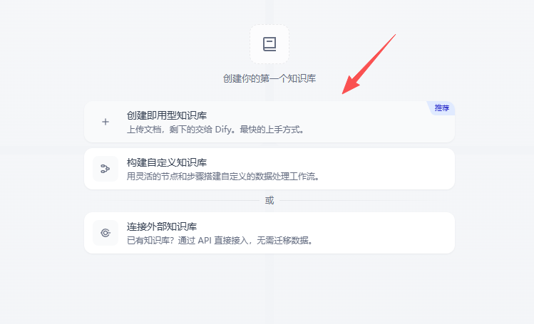
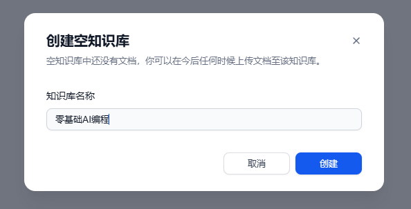

# 用RuyiDify创建通用型知识库：先建空库，再让资料有地方生长

OK，OK，大家好，欢迎大家来到大鹏 AI 教育，我是张大鹏。

很多人第一次用 Dify 知识库，第一反应是上传文件。

但我在 RuyiDify 里讲知识库时，反而会先讲一个看起来很小的动作：创建一个通用型的空知识库。

为什么？

因为在真实项目里，知识库不是“我临时上传一个文件试试看”。它应该先有一个明确的容器，知道自己服务什么业务、收哪些资料、后面怎么持续维护。先建空库，不是绕远路，而是在给后面的资料治理留位置。

这篇文章我就用 RuyiDify 的课程截图，把“创建通用型知识库”这一步讲清楚。

## 第一步：选择创建通用型知识库

在 Dify 创建知识库时，入口里会看到“创建即用型知识库”“构建自定义知识库”“连接外部知识库”等选项。

我们这里选的是“创建即用型知识库”，也就是我在课件里说的通用知识库。

这个选择适合绝大多数入门和业务演示场景。

- 📌 **它足够直接**：先用 Dify 内置知识库完成上传、切分、索引、检索这条主线。
- 🧪 **它方便教学**：学员可以先看到完整流程，再去理解外部知识库和自定义工作流。
- 🧱 **它适合做项目底座**：先把知识库容器建出来，后续再逐步放入课程资料、企业文档、FAQ 或产品手册。

我不建议一开始就讲外部知识库。

外部知识库适合已经有自研 RAG、向量库或企业搜索系统的团队。对大多数学员来说，先把 Dify 内置知识库跑通，理解它怎么切分、怎么检索、怎么进入工作流，价值更大。

## 第二步：创建一个空知识库

进入上传资料页面后，很多人会急着拖文件。

但在课程里，我会先让大家点击“创建一个空知识库”。

这个动作很关键。

空知识库的价值不在“空”，而在“先定边界”。

一个知识库到底放什么，不放什么，后面会直接影响回答质量。

如果你什么资料都往一个库里塞，制度、营销话术、课程讲义、售后问题、旧版本产品手册混在一起，最后检索出来的上下文就很容易乱。

所以我更愿意先创建一个清晰命名的空库，再按业务逐步导入资料。

- 🧭 **先确定用途**：这个库是服务课程问答，还是服务企业内部制度，还是服务产品说明？
- 🗂️ **先确定资料范围**：只放一个主题的资料，不要一上来做大杂烩。
- 🔁 **先确定维护方式**：后面是手动上传，还是通过 API 或脚本持续同步？

这就是我说的：知识库不是文件夹，它是一个长期维护的上下文容器。

## 第三步：输入知识库名称

创建空知识库时，需要输入知识库名称。

课件里我用的示例名称是“零基础AI编程”。

命名这一步不要随便写。

很多知识库后面不好维护，不是因为模型不行，而是最开始命名就含糊。

比如“资料库”“测试库”“临时知识库”这种名字，刚创建时看起来没问题，过两周你自己都不记得里面到底放过什么。

我更建议用能表达业务边界的名字。

- ✅ **课程型**：零基础AI编程、Dify知识库开发入门、RuyiDify实战课资料库。
- ✅ **业务型**：售后FAQ知识库、产品使用手册知识库、员工制度知识库。
- ✅ **版本型**：2026版课程资料库、V1产品文档知识库。

命名越清楚，后面做检索测试、权限管理、资料更新和问题定位就越轻松。

这是一个很小的动作，但它体现的是工程习惯。

## 第四步：创建完成后进入知识库页面

创建完成后，我们会进入知识库的文档页面。

这时候库里还没有文档，但结构已经出来了。

这一步意味着什么？

意味着我们已经有了一个可以持续生长的知识库容器。

接下来才是导入资料、切分文档、等待索引、测试召回、接入应用或工作流。

在 Dify 里，一个知识库真正进入使用状态，大概还要走这几件事：

- 📄 **导入文档**：上传 PDF、Markdown、Word、网页或其他结构化资料。
- ✂️ **处理与切分**：决定文档如何拆成 chunks，避免上下文过碎或过大。
- 🧬 **索引与向量化**：让资料可以被语义检索，而不是只能按关键词搜索。
- 🔎 **召回测试**：用真实问题检查能不能找回正确片段。
- 🧠 **接入应用**：在聊天应用或 Chatflow 中使用 Knowledge Retrieval 节点。

所以，看到这个页面时，不要以为知识库已经“完成”了。

它只是建好了地基。

## 为什么我在 RuyiDify 里要先讲这个小流程

这四步看起来很简单：

- 🧱 创建通用知识库。
- 📦 创建空知识库。
- ✍️ 输入知识库名称。
- ✅ 完成知识库创建。

但它背后对应的是一个更重要的训练目标：让学员从第一步就建立知识库边界意识。

我不希望大家把 Dify 学成“哪里有按钮就点哪里”。

我希望大家在创建知识库时就会想：

- 🔍 这个知识库解决什么问题？
- 🗂️ 它应该收哪些资料，不应该收哪些资料？
- 🧪 后面准备用哪些问题测试它？
- 🔁 资料更新以后，谁来维护，怎么同步？
- 🧠 它最终要接到聊天应用，还是接到工作流节点？

如果这些问题不想清楚，后面就很容易变成“资料都上传了，为什么回答还是不准”。

答案往往不是 Dify 不行，也不是模型不行。

很多时候，是知识库从创建开始就没有边界。

## 通用型知识库适合先跑通主线

我会把通用型知识库放在 RuyiDify 知识库章节的前半部分。

原因很简单：它最适合跑通主线。

先让大家看到一个最小闭环：

- 🧱 先创建知识库。
- 📄 再上传资料。
- 🔎 再做检索测试。
- 💬 再接入应用问答。
- 🧪 最后用问题验证效果。

等这个闭环跑通以后，再讲外部知识库、API 自动化维护、多模态知识库，就不会飘。

因为学员已经知道一个知识库从空到可用，中间到底发生了什么。

## 这一步简单，但不要跳过

很多复杂系统的坏味道，都是从“先随便建一个”开始的。

知识库也是一样。

你今天随便建一个库，随便起一个名字，随便上传几份资料，明天就会发现回答开始混乱，后天就会发现没人知道这个库该不该删。

所以我在 RuyiDify 里会认真讲这一步。

不是因为它难。

而是因为它代表一种做项目的方式：先定边界，再放资料；先跑闭环，再谈高级能力；先让知识库有秩序，再让 AI 基于它回答问题。

下一步，我会继续把这个空知识库往前推进：上传资料、等待索引、做召回测试，然后接到 Dify 应用里，看看它到底能不能回答出我们想要的结果。

