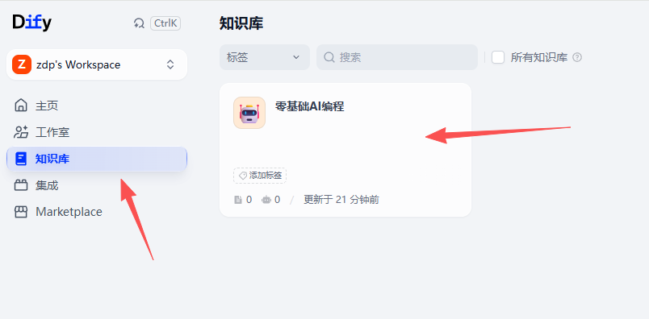
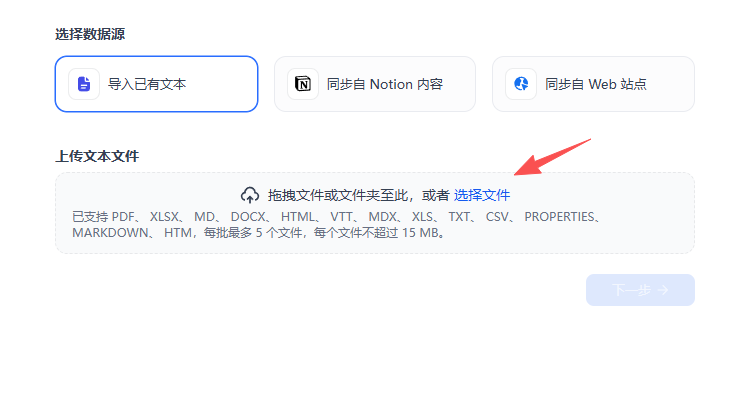
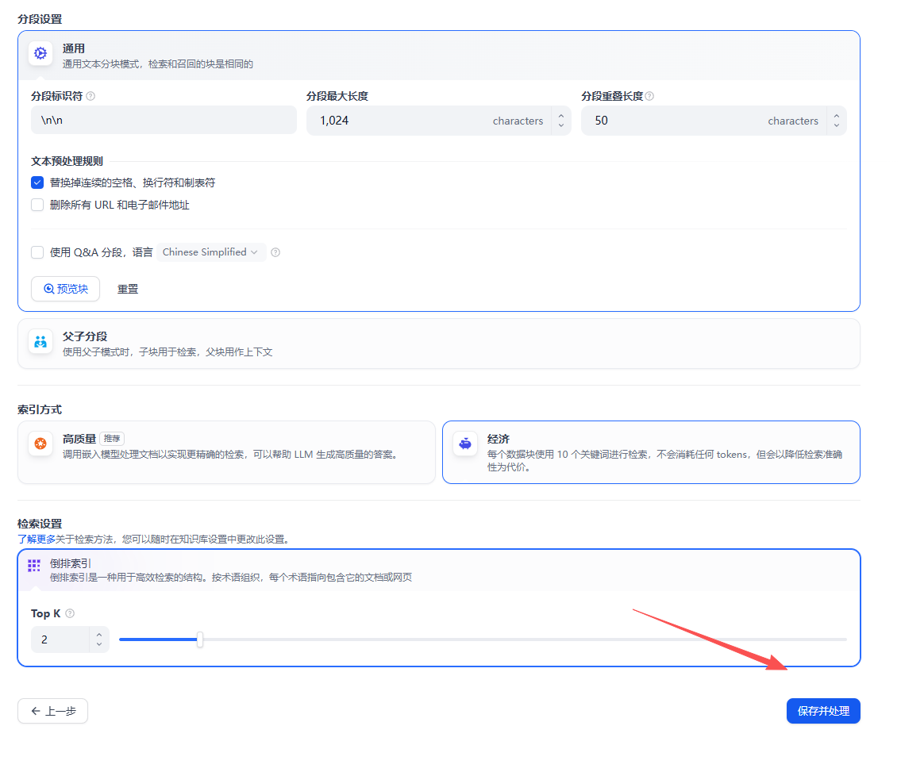
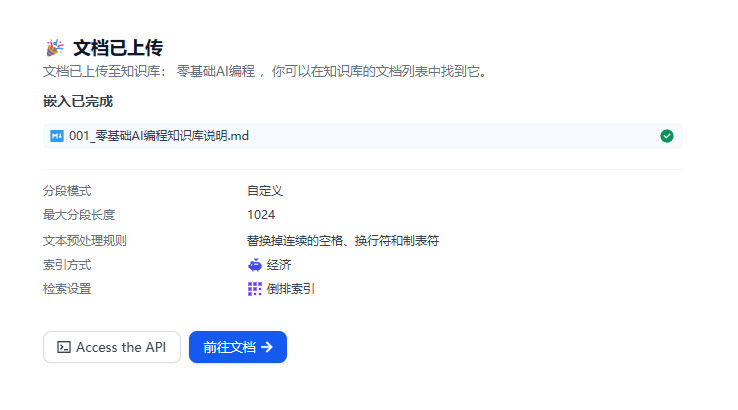

# RuyiDify如何上传文件到知识库：从选择文档到保存处理

OK，OK，大家好，欢迎大家来到大鹏 AI 教育，我是张大鹏。

上一篇我们讲了怎么在 RuyiDify 里创建一个通用型知识库。

知识库建好以后，真正的工作才刚开始：我们要把资料上传进去，让 Dify 把这些资料处理成可以检索的知识片段。

这一步看起来像是“点一下上传文件”，但我在课程里不会这么讲。因为上传知识库，本质上是在决定一份资料后面怎么被切分、怎么被索引、怎么被检索，最后怎么进入大模型的上下文。

这篇文章就按课件里的流程，讲一遍 RuyiDify 如何把文件上传到知识库。

## 先进入目标知识库

我们先进入 Dify 的知识库页面，找到刚创建好的知识库。

我这里用的示例知识库叫“零基础AI编程”。

这一步很简单，但有一个小提醒：不要把资料随手上传到任意知识库里。

知识库要有边界。

如果这个库叫“零基础AI编程”，那它就应该主要放零基础学员能看懂、能用上的资料，比如课程说明、基础术语、操作步骤、常见错误。不要把其他课程、内部笔记、过期资料一起塞进去。

知识库越干净，后面的检索越稳定。

## 点击添加文件

进入知识库后，如果里面还没有文档，会看到“还没有文档”的提示。

这时候点击“添加文件”。

在 RuyiDify 的课程里，我会把这里解释成“给知识库添加第一份可检索资料”。

不是所有资料都适合作为第一份文件。

第一份资料最好是边界清晰、内容稳定、能代表这个知识库用途的文档。比如我前面建议过的“零基础AI编程知识库说明”，它不是某个复杂技术点，而是告诉这个知识库服务谁、收什么资料、不收什么资料、回答问题时应该遵循什么原则。

这样的文件放进去，后面问知识库定位、资料边界、回答方式时，系统就有依据。

## 选择要上传的文件

进入上传页面后，选择“导入已有文本”，然后拖拽文件，或者点击“选择文件”。

从截图里可以看到，Dify 支持很多常见格式，比如 PDF、XLSX、Markdown、HTML、TXT、CSV 等。

但对零基础课程来说，我更推荐先用 Markdown。

原因很简单：

- 📄 **内容结构清楚**：标题、段落、列表都比较明确。
- 🔍 **更容易检索**：文本干净，切分后更容易命中问题。
- 🧪 **方便调试**：如果回答不准，可以直接回到 Markdown 里改内容。
- 🔁 **适合持续维护**：后续新增资料、修改资料都比较轻。

PDF 当然也能用，但 PDF 经常会遇到排版、页眉页脚、换行、表格解析之类的问题。入门阶段先用 Markdown，把主流程跑通，会更稳。

## 配置分段和索引参数

选择文件后，会进入分段和索引设置页面。

这张页面是上传知识库时最值得讲的一页。

很多同学会直接点“保存并处理”，但我建议先理解几个关键参数。

### 分段标识符

分段标识符表示系统用什么符号判断一段结束。

截图里是 `\n\n`，意思是两个换行，也就是按自然段切分。

如果你的资料本来就是按段落写的，这个设置通常比较合适。

### 分段最大长度

分段最大长度表示每个文本块最多多少字符。

截图里是 `1024 characters`，也就是一个 chunk 最多 1024 个字符。

这个值太小，内容容易被切碎；太大，检索时可能带入太多无关信息。

### 分段重叠长度

分段重叠长度表示相邻两个文本块之间保留多少重复内容。

截图里是 `50 characters`。

这个设置是为了避免上下文被切断。比如一句话或一个概念刚好跨在两个 chunk 中间，有一点重叠可以让前后文更连续。

### 文本预处理规则

截图里勾选了“替换掉连续的空格、换行符和制表符”。

这一步是清理文本，让资料更干净。

如果资料里有很多无意义空格、乱换行、制表符，检索效果会受影响。

另一个选项是“删除所有 URL 和电子邮件地址”。如果链接和邮箱不是知识内容的一部分，可以删除；如果链接本身是资料证据，就不要随便删。

### Q&A 分段

Q&A 分段适合 FAQ、题库、客服问答这类资料。

如果你的文档本来就是“一问一答”的结构，可以考虑开启。

但普通课程讲义、操作说明、概念解释，一般先不用。

### 索引方式

截图里有“高质量”和“经济”两种方式。

高质量会调用嵌入模型处理文档，检索更准确，但会消耗 tokens。

经济方式主要使用关键词检索，不消耗 tokens，成本低，但准确度通常会差一些。

入门演示可以用经济方式跑通流程；真正做课程助教或企业知识库时，我更倾向于使用高质量索引，再配合检索测试看效果。

### Top K

Top K 表示每次检索最多返回多少个相关片段。

截图里是 `2`，表示最多返回 2 个文本块给模型参考。

Top K 不是越大越好。

太小可能漏掉证据，太大可能把噪音也带进上下文。

## 点击保存并处理

参数确认后，点击“保存并处理”。

这时候 Dify 会开始处理文档：读取文本、清理内容、切分 chunk、建立索引。

处理完成后，会进入结果页。

截图里可以看到，文档已经上传到知识库，并且显示了这次处理使用的设置：

- 📄 分段模式：自定义。
- ✂️ 最大分段长度：1024。
- 🧹 文本预处理规则：替换连续空格、换行符和制表符。
- 💰 索引方式：经济。
- 🔎 检索设置：倒排索引。

这页很适合用来做课堂复盘。

不是点完按钮就结束，而是要回头确认：刚才我们到底用什么方式处理了这份资料。

## 上传完成后还要做检索测试

文档上传成功，不等于知识库已经好用。

下一步一定要做检索测试。

我建议至少准备 3 类问题：

- 🎯 **定位类问题**：这份资料是做什么的？适合谁使用？
- 🧩 **概念类问题**：某个术语是什么意思？和另一个概念有什么区别？
- 🛠️ **操作类问题**：遇到某个步骤该怎么做？报错后怎么排查？

如果这些问题都能召回正确内容，说明第一份资料已经有基本价值。

如果召回不到，先不要急着换模型。

要先检查：

- 🔍 资料里有没有写清楚答案。
- ✂️ 分段是不是把上下文切碎了。
- 📏 分段长度和重叠长度是否合适。
- 🔎 索引方式是否适合当前资料。
- 🧪 问题表达是否和资料里的概念严重不一致。

这就是我一直强调的：知识库不是上传完成就结束，而是上传、处理、检索、验证这一整套流程。

## 我为什么把这一步放进 RuyiDify 课程

很多 AI 应用做不稳，不是因为界面不漂亮，也不是因为模型不够大。

而是知识库这一步太粗糙。

资料随便放，文件名随便起，参数随便点，上传完不测试。最后问答不准，就开始怀疑 Dify、怀疑模型、怀疑 RAG。

真正做项目，应该反过来：

- 🧱 先建清楚知识库边界。
- 📄 再上传合适的第一份资料。
- ✂️ 再理解分段和索引参数。
- ✅ 再保存处理。
- 🧪 最后用真实问题做检索测试。

这条链路跑通了，后面再讲高质量索引、Rerank、元数据过滤、外部知识库 API，学员才不会飘。

RuyiDify 这门课，我希望大家不是学会“上传文件”。

而是学会判断：一份资料怎么进入知识库，怎么被处理成上下文，怎么被模型使用，最后怎么验证它真的能帮用户回答问题。

