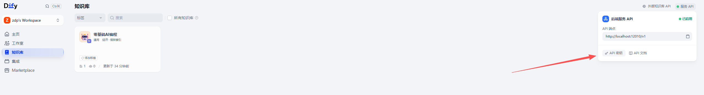
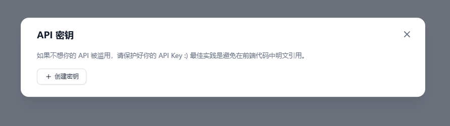
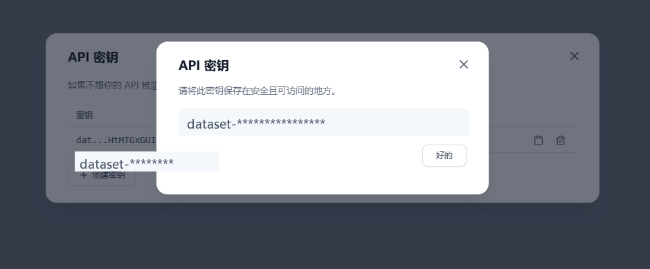

# RuyiDify如何创建知识库API密钥：让程序安全访问知识库

OK，OK，大家好，欢迎大家来到大鹏 AI 教育，我是张大鹏。

前面我们已经完成了两件事：先创建知识库，再把文件上传进去。

接下来很关键的一步，是给这个知识库创建 API 密钥。

为什么要创建 API 密钥？

因为只靠网页操作，知识库还是一个人工维护的资料库；有了 API 密钥，程序、脚本、后端服务才可以安全地访问这个知识库，后面才能做自动上传文档、查询知识库、管理资料这些工程化动作。

这篇文章就按 RuyiDify 课件第 15 页的流程，讲一遍如何创建知识库 API 密钥。

## 先找到知识库的服务 API 入口

进入 Dify 的知识库页面后，右侧会看到一个“服务 API”区域。

这里会显示当前知识库的 API 端点，也会有“API 密钥”和“API 文档”入口。



这一步要注意：我们现在讲的是“知识库 API 密钥”，不是应用 API 密钥。

两者作用不一样。

- 🔑 **知识库 API 密钥**：用于通过程序访问知识库，管理文档、上传资料、检索知识库。
- 💬 **应用 API 密钥**：用于调用某个 Dify 应用，比如聊天应用、工作流应用。

如果这节课讲的是“让程序操作知识库”，就应该从知识库详情页里的服务 API 入口开始。

## 打开 API 密钥窗口

点击“API 密钥”以后，会弹出 API 密钥管理窗口。

如果还没有创建过密钥，这里会显示“创建密钥”按钮。



这个页面上有一句提醒很重要：

不要在前端代码中明文引用 API Key。

我会在课堂里反复强调这一点。

API Key 不是普通配置项，它是访问凭证。谁拿到它，谁就可能访问这个知识库的 API。

所以它应该放在哪里？

- ✅ **后端服务环境变量**。
- ✅ **本地脚本的安全配置文件**。
- ✅ **部署平台的 Secret 管理里**。
- ✅ **只给可信任的服务器使用**。

不应该放在哪里？

- ❌ 前端页面代码。
- ❌ 公开 Git 仓库。
- ❌ 博客正文。
- ❌ PPT 截图原图里。
- ❌ 群聊、公开文档、录屏里完整展示。

密钥管理是 AI 项目工程化里很基础的一步。越是入门课，越要从一开始把这个习惯讲清楚。

## 点击创建密钥并复制保存

点击“创建密钥”后，系统会生成一个知识库 API Key。

截图里我已经把真实密钥打码，只保留格式示意。



生成后，通常要立刻复制保存。

很多系统只会完整展示一次密钥，关掉窗口后只能看到部分内容，不能再次查看完整值。

所以我的建议是：创建后马上复制到安全位置。

可以按这种方式保存：

```env
DIFY_DATASET_API_KEY=dataset-****************
DIFY_API_BASE_URL=http://localhost:12010/v1
```

这里的 `dataset-****************` 只是示意，不是真实密钥。

如果是在 RuyiDify 本地课程环境里，API 端点可能是本地地址；如果部署到服务器，就应该换成服务器的访问地址。

## 这个密钥后面能做什么

知识库 API Key 创建好以后，后面就可以进入“程序访问知识库”的阶段。

它常见的用途有这些：

- 📄 **上传文档**：用脚本把本地 Markdown、PDF、TXT 等资料上传到知识库。
- 🔁 **同步资料**：把课程资料、企业文档或 Git 仓库文档定期同步进去。
- 🔎 **检索知识库**：通过 API 根据问题检索相关内容。
- 🧹 **维护文档**：删除过期资料、更新文档、管理 chunks。
- 🧪 **做自动化测试**：每次资料更新后，用固定问题检查检索效果。

这也是我为什么把 API Key 放到知识库章节里讲。

它不是为了“多一个按钮教程”。

它代表知识库从手工操作走向工程化。

## 创建密钥后要立刻建立安全习惯

很多同学刚开始做 AI 项目，容易把 API Key 当成普通字符串。

这很危险。

知识库里可能有课程资料，也可能有企业文档、客户资料、内部制度。密钥一旦泄露，外部程序就可能拿它访问这些内容。

所以在 RuyiDify 里，我会给学员一个简单规则：

密钥只在需要调用 API 的地方出现，其他地方都不出现。

具体做法：

- 🔐 **写代码时**：从环境变量读取，不直接写死在代码里。
- 🧾 **写教程时**：使用 `dataset-****************` 这类假值。
- 🎥 **录课时**：创建密钥后立刻打码或重新生成。
- 🧹 **误泄露时**：立即删除旧密钥，重新创建新的密钥。

这个习惯会让后面所有 API 调用课程更安全。

## 我会怎么把这一步放进 RuyiDify 课程

这一步在 PPT 里可以拆成三页：

- 🧭 **第 1 页：找到服务 API**  
  告诉学员知识库 API 入口在哪里，区分知识库 API 和应用 API。

- 🔑 **第 2 页：创建 API 密钥**  
  解释密钥是程序访问知识库的凭证，不要暴露在前端和公开资料里。

- 📋 **第 3 页：复制并保存密钥**  
  讲清楚密钥只展示一次的风险，以及应该保存到环境变量或 Secret 里。

然后再接下一节：用这个 API Key 调用知识库接口。

那时课程就不再停留在网页操作，而是进入真正的工程化阶段。

## 一句话总结

知识库 API Key 是程序访问知识库的钥匙。

创建它很简单，但真正重要的是知道它能做什么、应该放在哪里、不能暴露给谁。

RuyiDify 讲这一步，不是为了让大家多记一个按钮，而是为了把知识库从“人工上传资料”推进到“程序化维护资料”。

