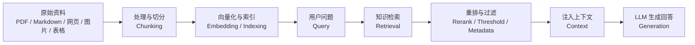

# Dify 知识库专题笔记

更新时间：2026-07-09

## 一句话理解

Dify 知识库是把企业或个人自己的资料变成大模型可检索上下文的能力。它不是简单的文件仓库，而是一套围绕 RAG 的资料导入、切分、索引、检索、重排、引用和工作流集成机制。

## 核心链路

## RuyiDify 可以重点讲什么

### 知识库不是上传资料这么简单

很多人第一次用 Dify 知识库，会以为“把 PDF 上传进去，问答就好了”。真正做项目时，问题往往出在资料质量、切分策略、检索参数、模型选择和业务验证上。

课程里可以这样讲：

- 资料越杂，越需要先做清洗和结构化。
- 切分太碎，回答容易失去上下文。
- 切分太大，召回和重排压力会变大。
- Top K 太低可能漏信息，太高可能引入噪音。
- Score Threshold 太高会拒绝很多内容，太低会让无关内容进入上下文。
- Rerank 不是装饰，它决定最后进入模型的证据顺序。

### Knowledge Retrieval 节点是工作流里的 RAG 入口

在 Chatflow 或 Workflow 中，Knowledge Retrieval 节点负责根据用户问题去知识库里找证据。它的输出通常接到 LLM 节点的 Context。

适合设计一个最小演示：

1. 用户输入课程问题。
2. Knowledge Retrieval 检索课程资料知识库。
3. LLM 节点只基于检索到的上下文回答。
4. Answer 节点输出答案。

可以扩展的演示：

- 多知识库同时检索。
- 用元数据过滤不同课程、章节、版本。
- 对比启用和不启用 rerank 的回答差异。

### API 能把知识库从手工产品变成工程系统

Knowledge Base API 适合做自动化导入、增量同步、批量维护文档和 chunks。对 RuyiDify 二开来说，这一块很有商业价值，因为企业客户往往不是只上传一次资料，而是持续同步内部文档、制度、产品手册、工单和 FAQ。

可以设计的二开功能：

- 本地文件夹同步到 Dify 知识库。
- Git 仓库文档同步到知识库。
- 企业网盘资料同步到知识库。
- 定时扫描更新并重新索引。
- 导入后自动跑一组检索测试题。

### 外部知识库适合已有 RAG 基础设施的客户

如果客户已经有向量库、搜索系统、LlamaIndex、LangChain 或自研知识服务，就不一定要把内容搬进 Dify。可以实现 Dify 的 External Knowledge API，让 Dify 只负责调用外部检索服务并把结果交给应用。

这个模式的边界很清楚：

- Dify 负责发起检索请求。
- 外部服务负责鉴权、检索、排序和返回 chunks。
- Dify 不管理外部资料，也不修改外部知识库。

适合课程中的高级项目：

- 用一个本地 FastAPI 服务模拟外部知识库。
- 实现 `/retrieval` 接口。
- 把 Dify 配到这个外部知识库。
- 在 Chatflow 中检索外部服务返回的内容。

### 多模态知识库适合教学和企业资料场景

企业资料不只有文字。PPT、截图、架构图、产品照片、操作手册里的图片都可能是关键证据。多模态知识库让图片和文字一起进入语义检索链路。

适合 RuyiDify 的高级案例：

- 上传带截图的操作手册，让用户用文字描述问题并检索相关截图。
- 上传产品图文资料，让用户问“这个按钮在哪里”“这个流程图说明什么”。
- 上传架构图和说明文档，让视觉模型结合图片上下文回答。

## 资料来源

- Dify Knowledge 概览：https://docs.dify.ai/en/cloud/use-dify/knowledge/readme
- Knowledge Retrieval 节点：https://docs.dify.ai/en/cloud/use-dify/nodes/knowledge-retrieval
- Manage Knowledge via API：https://docs.dify.ai/en/cloud/use-dify/knowledge/manage-knowledge/maintain-dataset-via-api
- External Knowledge API：https://docs.dify.ai/en/cloud/use-dify/knowledge/external-knowledge-api
- Connect to External Knowledge Base：https://docs.dify.ai/en/cloud/use-dify/knowledge/connect-external-knowledge-base
- Knowledge Pipeline：https://dify.ai/blog/introducing-knowledge-pipeline
- Multimodal retrieval：https://dify.ai/blog/multimodal-retrieval-is-now-available-in-the-knowledge-base

